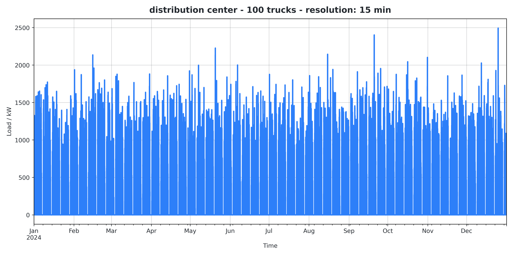
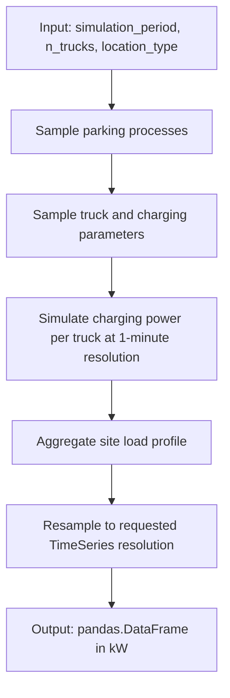

# `generate_truck_profile`

Generates a truck charging load profile and returns a `pandas.DataFrame` indexed by timestamp.

## Example

```python
from datetime import datetime, timedelta
from ieh_client import ProfileAPIClient

client = ProfileAPIClient()
df = client.generate_truck_profile(
    start=datetime(2026, 1, 1, 0, 0, 0),
    end=datetime(2026, 1, 2, 0, 0, 0),
    resolution=timedelta(minutes=15),
    n_trucks=25,
    location_type="warehouse",
    power_nom_charging_point_kw=300.0,
    charging_mode="DC",
)
```

## Parameters

| Name | Type | Allowed values | Description |
|---|---|---|---|
| `start` | `datetime` | Any valid datetime | Inclusive start timestamp. |
| `end` | `datetime` | Any valid datetime | Exclusive end timestamp. |
| `resolution` | `timedelta` | Any positive duration (internally converted to minutes) | Output time resolution. Default: `timedelta(hours=1)`. |
| `n_trucks` | `int` | Any integer accepted by API | Number of simulated trucks. Default: `1`. |
| `location_type` | `Literal[...]` | `"distribution_center"`, `"general_cargo_depot"`, `"cep_depot"`, `"shipping_center"`, `"warehouse"`, `"rest_stop"` | Logistics site type. |
| `power_nom_charging_point_kw` | `float` | Any float accepted by API | Nominal charging point power in kW. Default: `150`. |
| `charging_mode` | `Literal["AC", "DC"] \| None` | `"AC"`, `"DC"`, `None` | Charging mode selector. |
| `charging_efficiency` | `float` | Any float accepted by API | Charging efficiency factor. Default: `0.95`. |
| `soc_cc_to_cv` | `float` | Any float accepted by API | SOC threshold for CC-to-CV transition. Default: `0.8`. |
| `switch_off_power_kw` | `float` | Any float accepted by API | Stop charging when power falls below this threshold (kW). Default: `1.0`. |
| `min_charging_duration_minutes` | `int` | Any integer accepted by API | Minimum charging event duration (minutes). Default: `5`. |
| `country` | `str` | ISO country code supported by `holidays` (default `"DE"`) | Country for holiday handling. |
| `subdiv` | `str` | Subdivision code valid for selected `country` (default `"BW"`) | Regional subdivision for holiday handling. |

## Notes

- If `country != "DE"` or `subdiv != "BW"`, the client validates values via the optional `holidays` package.
- Invalid values raise `ValueError`; transport/API failures raise `ConnectionError`.

<picture>
  <source media="(prefers-color-scheme: dark)" srcset="pictures/distribution_center_100_trucks_15_min_dark.png">
  <source media="(prefers-color-scheme: light)" srcset="pictures/distribution_center_100_trucks_15_min_light.png">
  
</picture>

For usage examples, see [`../examples/example_truck_profile.py`](../examples/example_truck_profile.py).

## Quick Overview

The generator models three main steps:

1. Parking processes of trucks at a location
2. Truck fleet characteristics and parameters
3. Resulting aggregated charging profile as a `pandas.DataFrame`

## Methodology Flow (high level)



## Methodology (detailed, text-based)

### 1. Define input parameters

Input:
- Simulation period
- Number of trucks
- Location type (for example: depot, logistics center, rest stop)

These parameters define the simulation scenario.

### 2. Generate truck parking processes

- Simulate arrival times
- Determine parking duration
- Create on-site dwell time windows

Result: time windows in which trucks can potentially charge.

### 3. Sample vehicle and charging parameters

For each truck, sample:
- Battery capacity
- Initial SOC (state of charge)
- Target SOC
- Charging power
- Charging efficiency

This defines the individual charging behavior of each vehicle.

### 4. Simulate charging power per truck

- Run simulation at 1-minute resolution
- Compute charging progression during each parking window
- Determine charging power per vehicle over time

Result: per-truck charging power time series.

### 5. Aggregate site load profile

- Sum charging power across all trucks
- Compute total site load

Result: total charging park power over time.

### 6. Adjust time resolution

- Resample to requested output resolution
  (for example: 5 min / 15 min / 1 h)

This enables integration into energy system and grid models.

### 7. Output: charging park load profile

Output:
- Power time series
- Format: `pandas.DataFrame`
- Unit: kW

The profile describes the electrical load of the electric truck charging site.
